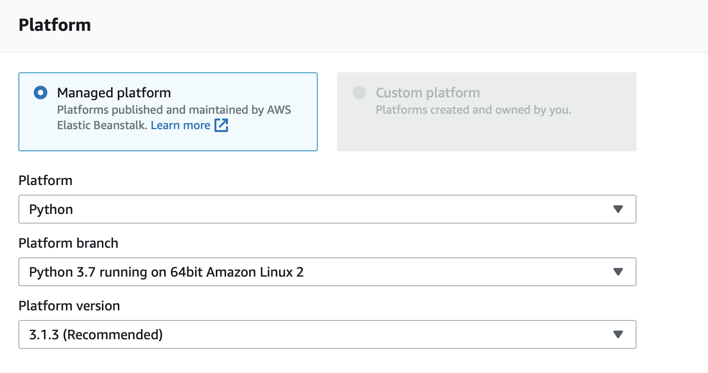
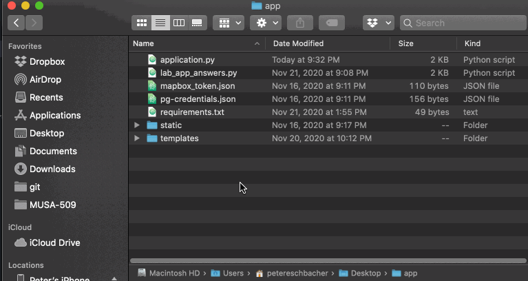
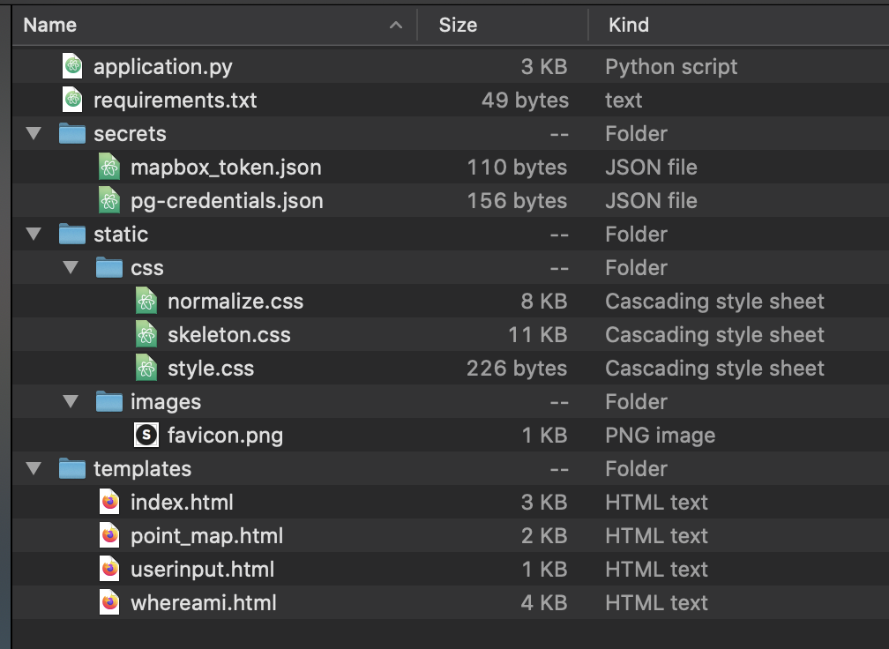

# Week 14 Lab — Deploying Web Apps

## Outline

* [`requirements.txt`](#requirements-txt)
* [Elastic Beanstalk](#elastic-beanstalk)

## `requirements.txt`

A `requirements.txt` ([documentation](https://pip.pypa.io/en/stable/reference/pip_install/#requirements-file-format)) file lists the Python dependencies for a project. The format is as follows:

```text
Flask==1.1.2
SQLAlchemy>=1.3.0
requests
```

Note that versions can be specified in multiple ways:

* `==` — only install this specific version
* `>=` — install the newest version above this or equal to it
* No version specifier — install the newest version

It's a good practice to specify versions because as new versions are released, changes to the packages could lead to changes that could break your code. For applications like the ones we're deploying, it's especially important to try to be as specific as possible with major version numbers.

There's a practice for versioning software called [Semantic Versioning](https://semver.org/) that helps narrow down versions of software to list in requirements.txt files:

> Given a version number MAJOR.MINOR.PATCH, increment the:
>
> 1. MAJOR version when you make incompatible API changes,
> 2. MINOR version when you add functionality in a backwards compatible manner, and
> 3. PATCH version when you make backwards compatible bug fixes.
>
> Additional labels for pre-release and build metadata are available as extensions to the MAJOR.MINOR.PATCH format.

It's a best practice to specify ranges, like so:

```text
Flask>=1.1.2,<2.0.0
SQLAlchemy>=1.3.0,<2.0.0
requests==2.25.0,<3.0.0
```

Read more about these specifiers in the [requirements specifiers documentation](https://pip.pypa.io/en/stable/reference/pip_install/#requirement-specifiers).

### Creating the requirements.txt files

For our projects, I recommend looking at the packages you are using in your Python scripts and manually creating the requirements.txt files. Hand-made, artisanal requirements.txt files. This is a pretty common way to create these files.

To get specific versions of your packages, you can run `conda list` at the command line and get an output like this:


**My advice on how to build a requirements.txt file**

1. Find the packages you list in your application.py file (avoid system ones like io, os, json, random, math, sys) and put each on a new line in your requirements.txt file. Try to keep this list as small as possible — usually only the specific packages listed as imports at the top of your application. You can find more information on the `pypi` pages. Here's `requests`' pypi page: <https://pypi.org/project/requests/>. You can change the package by changing the URL there.
2. Run `conda list` in the command line to list all packages installed and find the version numbers for each of these to add to your requirements.txt

### Side note

It's possible to convert your conda environment into a requirements.txt, but there are several issues that come with it. Read about it in [this nice StackOverflow post](https://stackoverflow.com/questions/50777849/from-conda-create-requirements-txt-for-pip3).

## Elastic Beanstalk

* https://console.aws.amazon.com/elasticbeanstalk/home

Deploy an app when you're ready to put it into production — that is, when you're ready for it to be in users hands. It's best to do all development of your application locally and push to production when it's ready for prime time.

### Deploy an app!
1. Create Application
   * Give it a name
   * Customize the URL
   * Select `Python`, use defaults (Python 3.7 running on Amazon Linux 2, etc.)
     
   * Upload your code! Make sure this is:
     - A zip file of your app's files, not a zip file of the folder that contains your app
       
   * Hit Create Application
   * While the application is provisioning all the services, let's look at the app:
     
2. Get oriented with the dashboard
   * Where is site hosted?
     * How do we solve issues if problems arise?


### Prompts / Practice EB

**What happens if you add a bad input into a form?**

It's always a good idea to monitor the application logs to ensure your application is acting normally to web traffic. Let's try to see if we can break our application.

1. Let's try to do a SQL injection attack by entering:
   ```
   '; SELECT * FROM andys_cookies; --
   ```
   What happens in the console? What's the status code?
2. Looking at the Logs, we can do some sleuthing about what is happening.

   [Internal Server Error (status code 500)](https://developer.mozilla.org/en-US/docs/Web/HTTP/Status/500)
   Here are the server logs for my application:
    <details>
    <summary>Server Logs (click to expand)</summary>
    ```
    ----------------------------------------
    /var/log/web.stdout.log
    ----------------------------------------
    Dec  3 02:41:09 ip-172-31-32-248 web: [2020-12-03 02:41:09 +0000] [3757] [INFO] Starting gunicorn 20.0.4
    Dec  3 02:41:09 ip-172-31-32-248 web: [2020-12-03 02:41:09 +0000] [3757] [INFO] Listening at: http://127.0.0.1:8000 (3757)
    Dec  3 02:41:09 ip-172-31-32-248 web: [2020-12-03 02:41:09 +0000] [3757] [INFO] Using worker: threads
    Dec  3 02:41:09 ip-172-31-32-248 web: [2020-12-03 02:41:09 +0000] [3822] [INFO] Booting worker with pid: 3822
    Dec  3 02:55:20 ip-172-31-32-248 web: WARNING:root:'; SELECT.* FROM andys_cookies;
    Dec  3 02:55:20 ip-172-31-32-248 web: ERROR:application:Exception on /whereami [GET]
    Dec  3 02:55:20 ip-172-31-32-248 web: Traceback (most recent call last):
    Dec  3 02:55:20 ip-172-31-32-248 web: File "/var/app/venv/staging-LQM1lest/lib/python3.7/site-packages/flask/app.py", line 2447, in wsgi_app
    Dec  3 02:55:20 ip-172-31-32-248 web: response = self.full_dispatch_request()
    Dec  3 02:55:20 ip-172-31-32-248 web: File "/var/app/venv/staging-LQM1lest/lib/python3.7/site-packages/flask/app.py", line 1952, in full_dispatch_request
    Dec  3 02:55:20 ip-172-31-32-248 web: rv = self.handle_user_exception(e)
    Dec  3 02:55:20 ip-172-31-32-248 web: File "/var/app/venv/staging-LQM1lest/lib/python3.7/site-packages/flask/app.py", line 1821, in handle_user_exception
    Dec  3 02:55:20 ip-172-31-32-248 web: reraise(exc_type, exc_value, tb)
    Dec  3 02:55:20 ip-172-31-32-248 web: File "/var/app/venv/staging-LQM1lest/lib/python3.7/site-packages/flask/_compat.py", line 39, in reraise
    Dec  3 02:55:20 ip-172-31-32-248 web: raise value
    Dec  3 02:55:20 ip-172-31-32-248 web: File "/var/app/venv/staging-LQM1lest/lib/python3.7/site-packages/flask/app.py", line 1950, in full_dispatch_request
    Dec  3 02:55:20 ip-172-31-32-248 web: rv = self.dispatch_request()
    Dec  3 02:55:20 ip-172-31-32-248 web: File "/var/app/venv/staging-LQM1lest/lib/python3.7/site-packages/flask/app.py", line 1936, in dispatch_request
    Dec  3 02:55:20 ip-172-31-32-248 web: return self.view_functions[rule.endpoint](**req.view_args)
    Dec  3 02:55:20 ip-172-31-32-248 web: File "/var/app/current/application.py", line 59, in whereami
    Dec  3 02:55:20 ip-172-31-32-248 web: lng, lat = resp.json()["features"][0]["geometry"]["coordinates"]
    Dec  3 02:55:20 ip-172-31-32-248 web: KeyError: 'features'
    ```
    </details>
3. Let's fix it in our code :)
   1. In `application.py`...
      * Comment out lines 68
      * Uncomment lines 72 - 79
   2. Start up the app locally
      * `conda activate musa509week6`
      * `python application.py`
      * <http://127.0.0.1:5000/whereami?address-text=%27%3B+SELECT+*+FROM+andys_cookies%3B>
   3. If you're curious, I updated the HTML file to conditionally look for `error_message`s.
      ```html
      
      <p class="error_message">{{ error_message }}</p>
      
      <h3>Try another one!</h3>
      
      ```
4. Make sure it's running correctly locally
5. Redeploy to Elastic BeanStalk &amp; check it works online too

**Let's add a new feature!**

Let's add the distance any address is from Meyerson Hall. We can use a Python library called [`geopy`](https://geopy.readthedocs.io/en/stable/) for this (there are several other options, including PostGIS for this).

1. Add `geopy` to our requirements.txt file
   ```
   geopy>=2.0.0,<3.0.0
   ```
2. Uncomment line 89
3. Make sure it works locally (`python application.py`)
4. Redeploy! Sometimes you need to do a hardrefresh to ensure the style sheets are refreshed in the browser cache.
